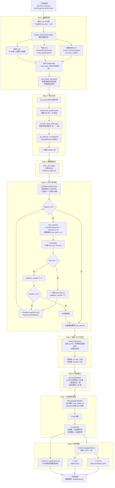

```mermaid
flowchart TD
    A["🚀 开始训练<br/>DEVICE=cuda/cpu<br/>EPOCHS=50, BATCH=64"] --> B

    subgraph S1["Step 1: 数据加载"]
        B["遍历 100 个杆塔<br/>TOWER_HN_001 ~ 100"] --> C["merge_multimodal_data()<br/>按时间戳合并"]
        C --> C1["泄漏电流 CSV<br/>current_mean/var/peak<br/>harmonic_3rd/5th"]
        C --> C2["气象 CSV<br/>temperature/humidity<br/>wind_speed/rainfall"]
        C --> C3["标签 CSV<br/>0=正常 1=预警 2=故障"]
        C1 & C2 & C3 --> D["合并 DataFrame<br/>+ load_level（低谷/平段/高峰）"]
        D --> E["load_static_features()<br/>材质/高度/年限/高程<br/>环境/缺陷/检修"]
    end

    E --> S2

    subgraph S2["Step 2: 特征工程"]
        F["pd.concat 合并全部杆塔"] --> G["create_lstm_sequences()<br/>滑窗 240 步 × 10 特征"]
        G --> H["encode_static_features()<br/>材质/环境 映射为 int → 7 维"]
        H --> I["fit_scalers() + transform()<br/>StandardScaler 标准化"]
        I --> J["💾 保存 scalers.pkl"]
    end

    J --> S3

    subgraph S3["Step 3: 数据集划分"]
        K["train_test_split()<br/>分层 80/20<br/>stratify=y, seed=42"]
    end

    K --> S4

    subgraph S4["Step 4: LSTM 预训练"]
        L["LSTMFeatureExtractor<br/>双层单向 LSTM(128)<br/>+ 注意力 + 分类头(3类)"] --> M{"Epoch ≤ 50 ?"}
        M -->|是| N["train_epoch()<br/>CrossEntropyLoss + Adam(lr=1e-3)<br/>梯度裁剪 max_norm=1.0"]
        N --> O["evaluate()<br/>计算 Val Loss / Val Acc"]
        O --> P{"Val Loss ↓ ?"}
        P -->|是| Q["💾 保存 lstm_best.pt<br/>patience_counter = 0"]
        Q --> R["scheduler.step(val_loss)<br/>ReduceLROnPlateau"]
        P -->|否| S["patience_counter += 1"]
        S --> T{"counter ≥ 10 ?"}
        T -->|是| U["⏹ 早停触发"]
        T -->|否| R
        R --> M
        M -->|否| V["加载最佳模型 lstm_best.pt"]
        U --> V
    end

    V --> S5

    subgraph S5["Step 5: 提取 LSTM 特征"]
        W["extract_features()<br/>冻结 LSTM，仅用特征提取部分<br/>分类头丢弃"]
        W --> X["训练集: (N_train, 128)<br/>测试集: (N_test, 128)"]
    end

    X --> S6

    subgraph S6["Step 6: 特征融合"]
        Y["np.concatenate()<br/>LSTM 时序特征 128 维<br/>+ 静态特征 7 维<br/>= 融合特征 135 维"]
    end

    Y --> S7

    subgraph S7["Step 7: 训练随机森林"]
        Z["RFLeakageClassifier<br/>200 棵树, max_depth=20<br/>balanced 权重, gini 准则"]
        Z --> Z1["rf.fit() 训练"]
        Z1 --> Z2["rf.evaluate()<br/>训练集 + 测试集评估<br/>分类报告 + 混淆矩阵"]
    end

    Z2 --> S8

    subgraph S8["Step 8: 保存模型"]
        AA["FusionLeakageDetector<br/>组装 LSTM + RF"] --> AB["💾 lstm.pt<br/>torch.save(state_dict)"]
        AA --> AC["💾 rf.pkl<br/>joblib.dump"]
        Z2 --> AD["💾 feature_importance.csv<br/>135 维特征重要性排名"]
    end

    AB & AC & AD --> AE["✅ 训练完成<br/>模型路径: models/saved/"]
```